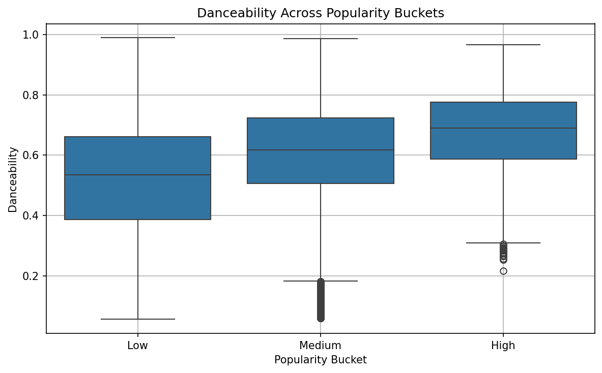
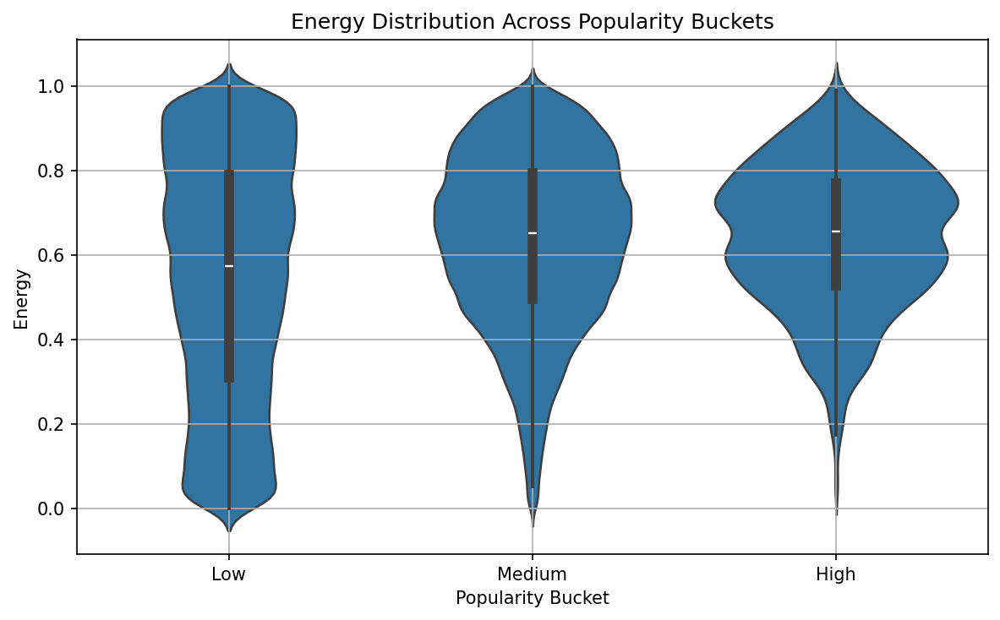
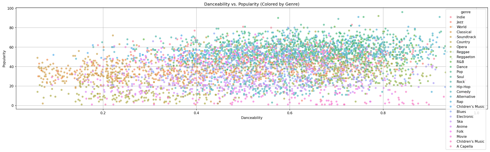
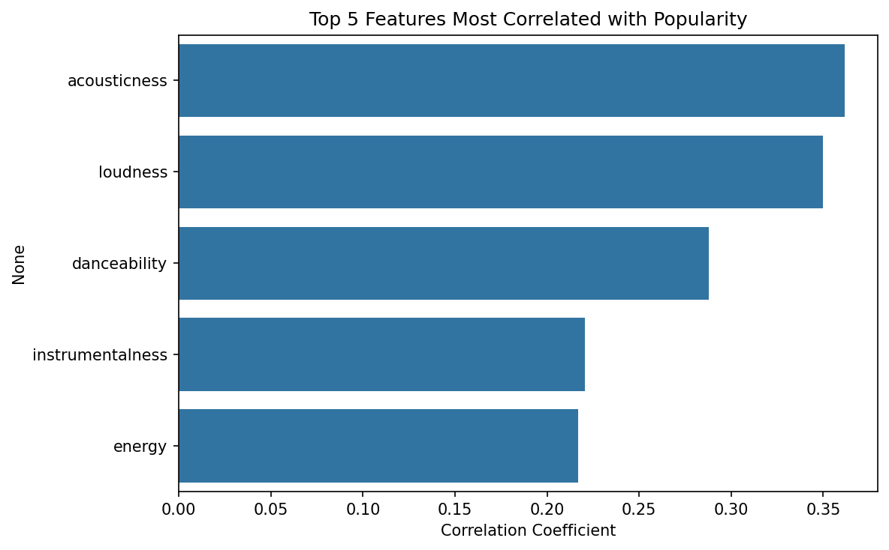
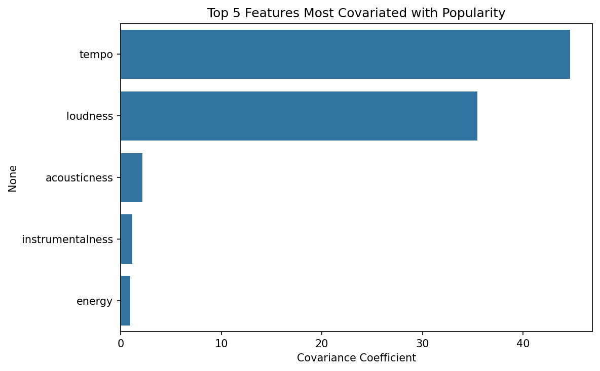
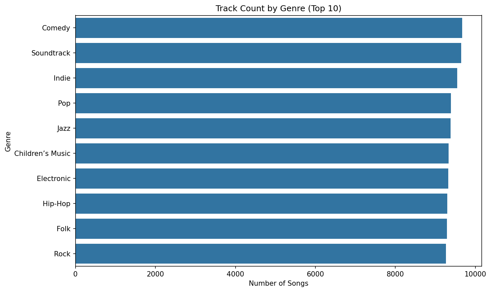
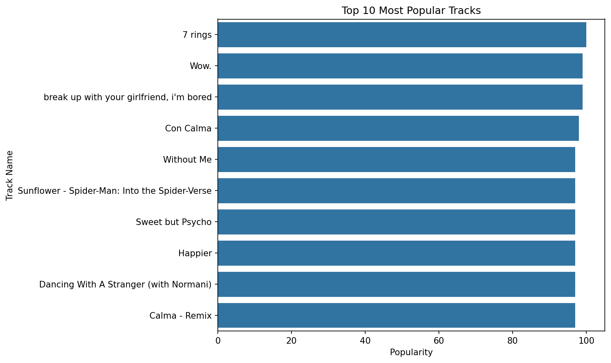
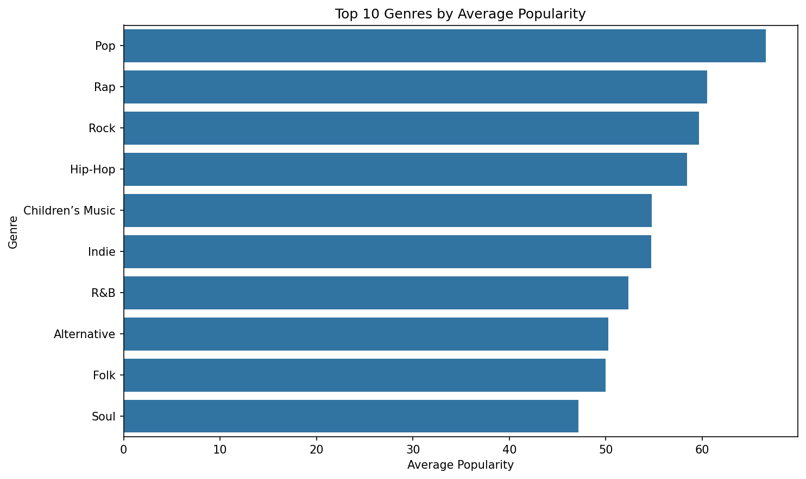
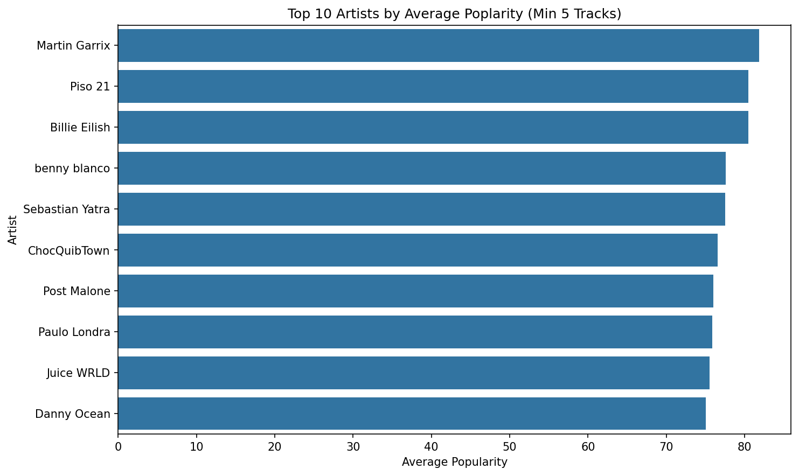

# Spotify Trend Analysis

A reproducible exploratory analysis of Spotify tracks and audio features to surface trends in popularity, genres, artists and feature interactions. The analysis is implemented in main.ipynb and uses the provided SpotifyFeatures.csv dataset.

## Project overview

This project explores which audio features and genres influence a track's popularity. The notebook performs data cleaning, feature engineering (e.g., duration in minutes, popularity buckets), and presents visual insights across four main areas:

1. What makes a song popular? (relationship of popularity with danceability, energy, valence, etc.)
2. Genre influence on audio features and popularity.
3. Feature correlations, covariances and interactions (heatmaps / pairplots).
4. Artist & track-level insights (top artists, most popular tracks).

All analysis, plots and code are in main.ipynb.

## Repository structure

- main.ipynb               - Primary Jupyter notebook with the analysis
- SpotifyFeatures.csv      - Dataset used by the notebook (not committed here if large)
- visuals/images/          - Folder for exported visualization images (created)
- README.md                - Project overview (this file)

## How to reproduce the visuals

1. Clone the repository:

   git clone https://github.com/MoinuddinDhorajiwala/Spotify-Trend-Analysis.git
   cd Spotify-Trend-Analysis

2. (Optional but recommended) Create a virtual environment and install dependencies (if you have a requirements.txt):

   python -m venv .venv
   source .venv/bin/activate  # macOS/Linux
   .venv\Scripts\activate     # Windows
   pip install -r requirements.txt

3. Open the notebook and run all cells:

   jupyter notebook main.ipynb

4. Save visualization images from the notebook to visuals/images/.

   In the notebook, after plotting a figure, save it with:

   plt.savefig('visuals/images/<figure_name>.png', dpi=150, bbox_inches='tight')

   Suggested filenames used in this README (examples):
   - visuals/images/danceability_boxplot.png
   - visuals/images/energy_violin.png
   - visuals/images/feature_correlation.png
   - visuals/images/popularity_over_time.png

Once saved, images will display in this README automatically.

## Preview 

## Contact

Moinuddin Dhorajiwala — https://github.com/MoinuddinDhorajiwala
